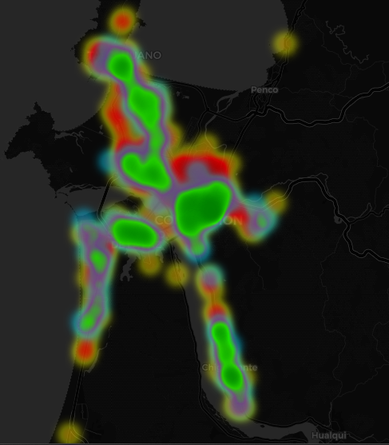

# Análisis de Vulnerabilidad Vial en el Gran Concepción

Un proyecto de **Ingeniería y Análisis de Datos** enfocado en la seguridad de los usuarios más vulnerables de las vías: ciclistas y motociclistas.

A través del procesamiento de datos abiertos gubernamentales, este proyecto busca identificar los "Puntos Negros" de accidentes de tránsito en el Gran Concepción para facilitar la toma de decisiones estratégicas en planificación urbana y seguridad vial.

## El Desafío
En lugar de analizar el tráfico general de automóviles, este análisis aísla los siniestros de vehículos de dos ruedas para responder:
- ¿Dónde están las "trampas mortales" para ciclistas y motociclistas?
- ¿Qué comunas presentan el mayor riesgo?
- ¿Cuál es la proporción de gravedad en los accidentes según el tipo de vehículo?

## Insights Clave
Tras procesar y geolocalizar la base de datos de siniestros, descubrimos patrones críticos:

1. **La Brecha de Riesgo (Moto vs. Bici):** Las motocicletas concentran la gran mayoría de los accidentes de dos ruedas, registrando **667 siniestros** frente a los 246 de las bicicletas.
2. **Concepción como Epicentro:** La comuna de Concepción lidera abrumadoramente el ranking de peligrosidad con **339 accidentes totales**, casi el doble que Talcahuano (183) y San Pedro de la Paz (170). Chiguayante se presenta como la zona con menos incidentes (101).
3. **Gravedad y Letalidad:** La tasa de lesiones graves en motociclistas es alarmante. De 667 accidentes, **195 resultaron en heridos graves y 12 fallecidos**. En contraste, las bicicletas presentan una mayor proporción de lesiones leves (152 de 246), aunque lamentando 3 víctimas fatales.

## Modelo Predictivo (Machine Learning)
Para llevar el análisis un paso más allá de la estadística descriptiva, se desarrolló una **Prueba de Concepto (PoC)** utilizando Machine Learning para predecir la gravedad de un siniestro (Leve vs. Grave/Fatal).

**Metodología:**
- **Algoritmo:** `RandomForestClassifier` (Bosque Aleatorio) optimizado para clases desbalanceadas.
- **Feature Engineering:** Codificación One-Hot para variables categóricas (Comuna, Día, Zona, Vehículo).
- **Métrica de éxito:** El modelo logró una precisión base del **63%** en un entorno altamente estocástico usando solo 4 variables predictoras.

**Feature Importance (Variables Críticas):**
El modelo determinó matemáticamente los factores que más aportan a la gravedad de un accidente de dos ruedas:
1. **Ir en Motocicleta (18.7%):** Es el factor determinante número uno de lesiones graves.
2. **Siniestro en Talcahuano (10.2%):** Revela que los accidentes en esta comuna tienden a ser más severos estadísticamente que en el resto del Gran Concepción.
3. **Días Lunes (8.8%) y Sábados (7.9%):** El modelo identificó un patrón de gravedad ligado al estrés del inicio de semana y la conducción de fin de semana.

## Stack Tecnológico
- **Python:** Lenguaje principal del análisis.
- **Pandas:** Extracción, Transformación y Carga (ETL), limpieza de datos nulos y normalización de texto.
- **Folium:** Generación de mapas de calor interactivos (`.html`) con capas separadas y paletas de colores personalizadas.
- **Git/GitHub:** Control de versiones bajo el estándar de *Conventional Commits*.

## Estructura del Proyecto
- `/data/raw/`: Bases de datos originales de CONASET (ignoradas en el repo por peso).
- `/data/processed/`: CSV final limpio, geolocalizado y filtrado por comunas objetivo.
- `/src/`: Scripts modulares de limpieza (`limpieza.py`), visualización (`mapa.py`) y análisis estadístico (`analisis.py`).
- `mapa_calor_interactivo.html`: Output final con la visualización espacial de los datos.

## Cómo ejecutarlo localmente
1. Clona este repositorio.
2. Instala las dependencias: `pip install -r requirements.txt`
3. Ejecuta los scripts en orden desde la carpeta `src/`.
4. Abre el archivo `.html` generado en tu navegador web.

---
*Datos obtenidos del catálogo de Datos Abiertos de CONASET (Comisión Nacional de Seguridad de Tránsito).*